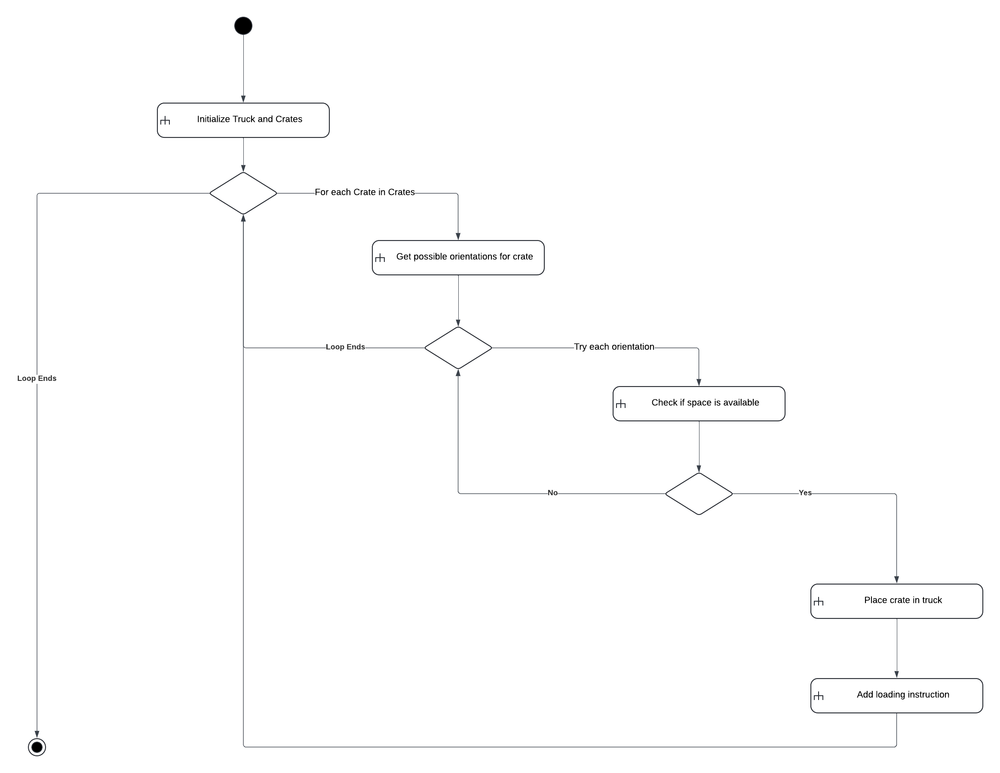

# HahnCargoTruckLoader Solution

## Project Structure

The `HahnCargoTruckLoader` solution consists of three projects:

1. **HahnCargoTruckLoader**:
   - This project contains the console application used for testing and demonstrating the core logic. It serves as a basic test harness for running the crate loading algorithm.

2. **HahnCargoTruckLoader.Library**:
   - This library project contains the core business logic and models for the crate loading algorithm. The code originally provided was refactored and organized into this library to maintain a clean separation of concerns and to make the core logic reusable across different applications.

3. **HahnCargoTruckLoader.WPF**:
   - This project is a WPF application used for visual testing and demonstration. It provides a graphical interface to visualize the loading of crates into a truck, making it easier to understand and debug the loading process.

## Activity Diagram

The following image represents the activity diagram for the crate loading algorithm implemented in this solution. It illustrates the flow of operations, including initialization, orientation checks, space availability checks, and the placement of crates.

## Lucidchart Diagram

For an interactive version of the activity diagram, you can view it on Lucidchart using the following link: [Lucidchart Activity Diagram](https://www.lucidchart.com/pages/).
